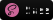
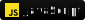
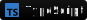
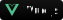

<h1 align="center">
	 Hello World 
</h1>

	

<h2>🧑 Sobre mim</h2>

 Olá, meu nome é Joe, sou um desenvolvedor de software. Sempre tentando construir coisas novas, seja usando tecnologias que conheço ou me aprofundando e estudando algo novo.

 Hello, my name is Joe, I'm a software developer. Always trying to build new stuff either using technologies I know or delving and studying something new.

<h2>🔬 Tecnologias</h2>

<h3 align="center">Linguagens, Frameworks, etc.</h3>

	
	
	
	
	
	
	
	
	
	

<h3 align="center">Bancos de Dados</h3>

	
	

<h3 align="center">Ferramentas</h3>

	
	
	

	
	
	

<h2>💬 Contato</h2>

